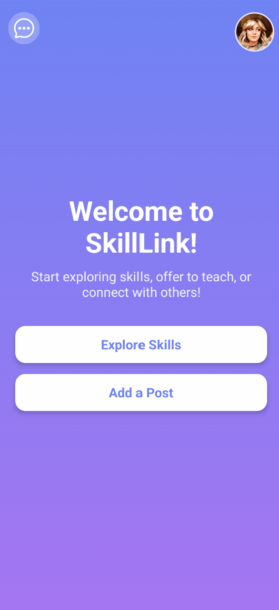

# SkillLink 🌐

SkillLink is a mobile-first skill-exchange platform that empowers users to showcase their talents, find collaborators, and connect with others for mutual learning or service exchange. Built with **React Native (frontend)** and **Spring Boot with AWS (backend)**, the app supports real-time messaging, secure authentication, and customizable skill listings.

---
Why this app? What are the features that make it different from other apps that do the same job of linking two people to learn from each other?
Not everyone can afford paid classes — and that’s okay. That’s exactly why my app exists. It gives people the chance to exchange skills instead. You teach something you know, and in return, you get to learn something new. But let’s be real — things aren’t always that simple. What if I want to learn piano, and the only person teaching piano wants to learn Spanish… but I don’t know Spanish? That’s where my app offers flexibility. If I can’t offer the skill they’re looking for, I can offer money instead. And if that’s still not the right fit, I can share a list of other skills I’m good at and willing to teach. This gives the other person more options — and maybe they’ll even discover something they didn’t know they wanted to learn. In the end, it’s all about making learning more accessible, flexible, and personal — whether through skill swaps, payments, or unexpected new interests.

---
## ✨ Features

-  **User Authentication**
  - Secure signup/login with bcrypt-hashed passwords
  - JWT-based session handling
  - Optional profile picture uploads
  - 

-  **Profile Management**
  - Add bio, offered skills, and desired skills
  - Upload and edit profile picture
  - View other users’ profiles
  - Pictures stored in AWS S3

-  **Skill Posts**
  - Create, edit, and delete skill exchange posts
  - Add preferences like:
    - Skill type (e.g., offering or seeking)
    - Payment type (paid, exchange, or free)
    - Price and exchangeable skills
  - Filter and explore posts

-  **Messaging**
  - Real-time chat using WebSockets
  - View all conversations in a dedicated screen
  - Message users directly from posts (except your own)
  - All messages are stored in PostgreSQL

-  **Backend Integration**
  - Spring Boot REST APIs
  - DynamoDB for user, post, and message data
  - WebSocket-based message handling
  - AWS S3 support for profile image uploads (planned/in progress)

---

##  Tech Stack

| Layer        | Technologies                                                    | 
|--------------|-----------------------------------------------------------------|
| Frontend     | React Native, Expo, React Navigation, AsyncStorage, SecureStore |
| Backend      | Spring Boot, WebSocket (STOMP), JWT, BCrypt                     |
| Database     | AWS DynamoDB, PostgreSQL                                        |
| Cloud Storage| AWS S3 (for profile images)                                     |
| Dev Tools    | Git, GitHub, Postman, VS Code, Android Studio                   |

**CLICK THE FOLLOWING PICTURE FOR THE DEMO VIDEO**

Upcoming Features
- Push notifications for new messages

- Email Verification (Currently working on)

- Video uploading options for skills

-AI integration to give users suggestions for learning new skills based on their current interests.

